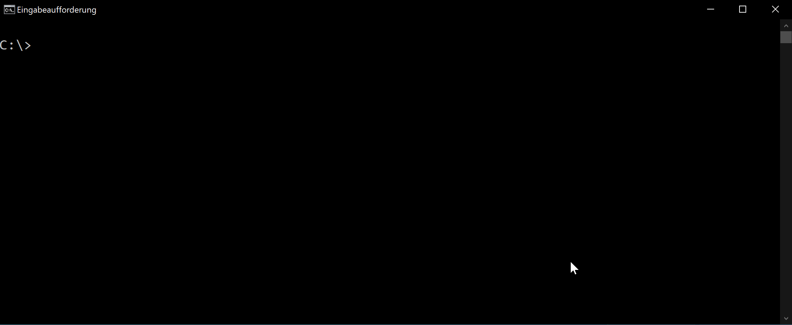

# BWI Coding Challenge

## Inhalt
In Bonn werden verschiedene Notebooks, Telefone und Tablets mit unterschiedlicher Dringlichkeit benötigt. Um mit der Auslieferung der ersten Fahrt einen möglichst hohen kumulierten Nutzen zu erzielen, wurde ein Algorithmus entwickelt, der eine optimale Beladung berechnet.

1. [Wahl des Algorithmus](#1.-wahl-des-algorithmus)
2. [Anforderungen](#2.-anforderungen)
3. [Ausführung](#3.-ausführung)
4. [Bildquellen](#4.-bildquelle)

---
## 1. Wahl des Algorithmus
Um die Transporter optimal zu beladen, habe mich für folgendes Vorgehen entschieden:

1.	Nutzwert pro Gewicht des Produkts berechnen.
2.	Absteigende Sortierung der Produkte nach ihrem Nutzwert pro Gewicht
3.	Befüllung der Transporter mit Produkten: Produkte mit höchstem Nutzwert pro Gewicht zuerst.
4.  Prüfen aller zu verladenen Produkte, ob sie durch ein schwereres Produkt mit höherem Nutzerwert ersetzt werden können.

Anmerkungen:

1.	Inspiriert durch die [Promo-Animation](https://www.get-in-it.de/imgs/it/codingCompetition/bwi/top_visual.mp4)  habe ich mich dazu entschieden die Informationen in eine .json-Datei auszulagern. JSON wird häufig zur Übertragung strukturierter Daten zwischen Clients und Servern genutzt.
2.	Der Algorithmus wurde so umgesetzt, dass er unabhängig von der Anzahl der Transporter, der Anzahl der Produkte, sowie der Informationen über die Produkte funktioniert.
3.	Das Programm erzeugt eine .HTML-Seite, welche Logistiker betrachten oder ausdrucken können um die Produkte optimal verladen zu können. 
4.	Das Programm gibt Informationen über zu verladene Produkte und die übriggebliebene Produkte als JSON aus um einen einfachen  Datenaustausches mit anderen Anwendungen zu ermöglichen. 

---

## 2. Anforderungen
Der Code wurde in Python Version 3.8.5 geschrieben und unter Ubuntu WSL2 sowie Windows 10 getestet. Neben den Python-eigenen Libraries werden keine Imports benötigt. Das Betrachen der HTML-Seite ist nur in Umgebungen mit grafischer Benutzeroberfläche möglich.

---
## 3. Ausführung
```
git clone https://github.com/benedikthafner/code_challenge.git
cd code_challenge
python main.py
```


---

Optimal beladen können sich die Transporter nach Bonn aufmachen :)

## 4. Bildquellen
1. Erster Post-Transporter: [Nutzer *Alexey* auf *Dibbble*](https://dribbble.com/shots/5732611-Animation-for-DHL?utm_source=Clipboard_Shot&utm_campaign=alexeysevercom&utm_content=Animation%20for%20DHL&utm_medium=Social_Share)
2. Zweiter Post-Transporter: [Nutzer *Alexey* auf *Dibbble*](https://dribbble.com/shots/5735552-Animation-for-DHL)
2. BWI-Logo: [Nutzer *Marsupilami* auf *Wikipedia*](https://de.wikipedia.org/wiki/Datei:BWI_GmbH_logo.svg)

